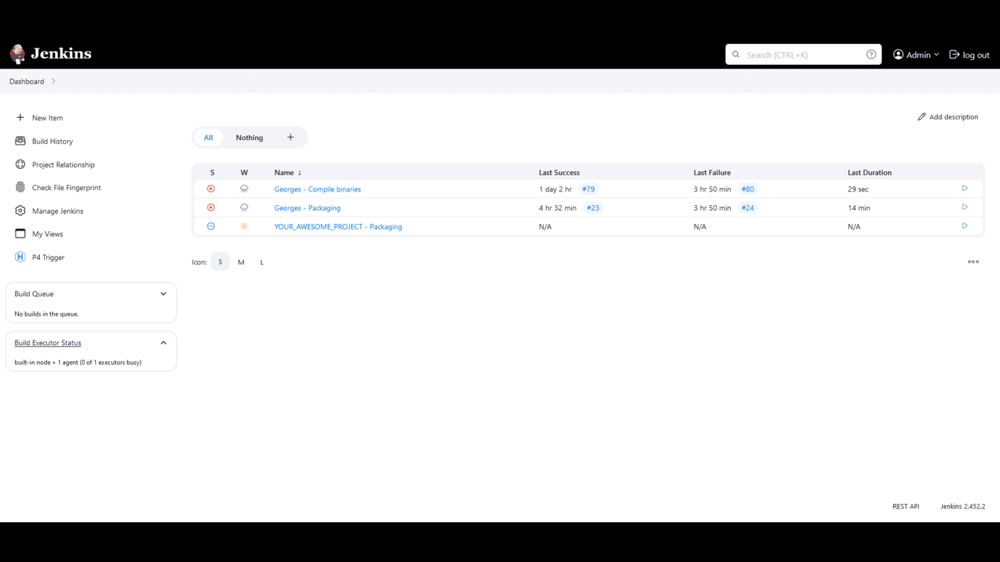

# Game production pipeline

[User documentation](docs/install-user.md) &mdash;
[Admin documentation](#installation) &mdash;
[License](LICENSE) &mdash;
[Contact](#contact)

Documentation hub to install and configure a game development pipeline (versioning, authentication, automatic build...) on self-host infrastructure.

## Table Of Contents

- [Game production pipeline](#game-production-pipeline)
  - [Table Of Contents](#table-of-contents)
  - [Why](#why)
  - [About The Project](#about-the-project)
  - [Screenshots](#screenshots)
  - [System](#system)
    - [Requirements](#requirements)
    - [Containers Overview](#containers-overview)
  - [Installation](#installation)
  - [License](#license)
  - [Contact](#contact)

## Why

This repository serves as a centralized hub for documentation, capturing the setup and configuration processes for our game development pipeline. It's designed to store comprehensive guides on versioning, authentication, automated builds, and other critical components, referencing official documentation to ensure accuracy and reliability. By documenting our configurations, we ensure consistency and facilitate easy replication for future setups or sharing with friends interested in similar projects.

## About The Project

We want our users to submit a change, create a review and have it trigger a build.  

For our pipeline, we will install several services :

- **Portainer** : User-friendly Docker container management tool with a web-based interface.
- **Nginx Proxy Manager** : User-friendly interface of a reverse proxy to expose your services easily and securely.
- **Helix Core** : Version control and collaboration platform widely used for managing source code and digital assets.
- **Helix Authentication Service** : Provides authentication and authorization services for securing access to Perforce applications.
- **Helix Swarm** : Code review and collaboration platform integrated with Helix Core.
- **Helix Digital Asset Management** : Solution for managing and versioning digital assets in a collaborative development environment.
- **Grafana** : Open-source platform for creating interactive and customizable dashboards to visualize time-series data.
- **Prometheus** : Open-source monitoring toolkit designed for collecting and processing time-series data.
- **Node Exporter** : Prometheus exporter that collects system-level metrics from Linux/Unix hosts, providing valuable insights into CPU, memory, disk, and network usage.
- **Jenkins** : Open-source automation server used for building, testing, and deploying software with support for continuous integration and delivery.

## Screenshots

  
  

  
  

  
  

## System

### Requirements

:warning: For the moment, this guide has only been tested on Helix Products versions 2024.1.

In these guide, we install all our services on one server due to lack of resources, but our documentation offers instructions for installing and connecting services in a game development pipeline, without imposing a specific infrastructure setup. Users have the freedom to deploy services on one machine or across multiple servers, enabling them to customize their infrastructure according to their preferences and requirements.

At the moment, we have tested and operated our pipeline on :

- OS : Debian 11
- Processor : 2.4GHZ 8-Core or 3.2GHZ 4-Core
- Memory : 16Go
- Hard Disk : 200GB

The recommended configuration is :

- OS : Any linux distribution
- Processor : 2.4GHZ 8-Core or 3.2GHZ 4-Core
- Memory : 8GO
- Hard Disk : 64GB

And if you wish to configure automatic build, we suggest you use another server so as not to slow down perforce performance during a build. In these case, the recommended configuration for the build agent is :

- OS : Windows 11
- Processor : 2.4GHZ 8-Core or 3.2GHZ 4-Core
- Memory : 8GO
- Hard Disk : 128GB

You can consult the official hardware requirements for each service :

- [Helix Core](https://www.perforce.com/manuals/p4sag/Content/P4SAG/install.planning.html)
- [Helix Swarm](https://www.perforce.com/manuals/swarm/Content/Swarm/setup.dependencies.html#Recommended_operating_systems)
- [Grafana](https://grafana.com/docs/grafana/latest/setup-grafana/installation/#hardware-recommendations)
- [Unreal Engine](https://dev.epicgames.com/documentation/en-us/unreal-engine/hardware-and-software-specifications-for-unreal-engine)

### Containers Overview

Here is a list of all the containers that can be installed in this guide :

| Service Name                 | Public             | Ports                                                                                                                 |
| ---------------------------- | ------------------ | --------------------------------------------------------------------------------------------------------------------- |
| Nginx Proxy Manager          | :heavy_check_mark: | <ul><li>Web - 80 - TCP</li><li>Web Admin - 81 - TCP</li><li>Web - 443 - TCP</li><li>Helix Core - 1666 - TCP</li></ul> |
| Helix Core                   | :heavy_check_mark: | <ul><li>Helix Core - 1666 - TCP</li></ul>                                                                             |
| Helix Authentication Service | :heavy_check_mark: | <ul><li>Web - 3000 - TCP</li></ul>                                                                                    |
| Helix Swarm                  | :heavy_check_mark: | <ul><li>Web - 80 - TCP</li><li>Web - 443 - TCP</li></ul>                                                              |
| Portainer                    | :heavy_check_mark: | <ul><li>Web Admin - 9443 - TCP</li></ul>                                                                              |
| Jenkins Main                 | :heavy_check_mark: | <ul><li>Web - 8080 - TCP</li><li>Agent - 50 000 - TCP</li></ul>                                                       |
| Jenkins Windows Agent        | :heavy_check_mark: | <ul><li>Web - 8006 - TCP</li><li>RDP - 3389 - TCP</li><li>RDP - 3389 - UDP</li></ul>                                  |
| Grafana                      | :heavy_check_mark: | <ul><li>Web Admin - 4000 - TCP</li></ul>                                                                              |
| Prometheus                   | :heavy_check_mark: | <ul><li>Web Admin - 9090 - TCP</li></ul>                                                                              |
| Node Exporter                | :x:                | <ul><li>Scrap Metrics - 9100 - TCP</li></ul>                                                                          |
| Redis Server                 | :x:                | <ul><li>Webdis - 7379 - TCP</li></ul>                                                                                 |

## Installation

:information_source: We also provide an [user installation guide](docs/install-user.md) to install P4V Client and how to use Helix Swarm.

1. Follow [Docker and Portainer installation guide](docs/install-docker.md).
2. (Optional) If you want to enhances security and reliability of the web server (force https, authentication on admin website...), follow the [Nginx Proxy Manager installation guide](docs/install-nginx-proxy-manager-interface.md).
3. Follow [Helix Core installation guide](docs/install-helix-core.md).
4. Follow [Helix Authentication installation guide](docs/install-helix-authentication-service.md).
5. Follow [Helix Swarm installation guide](docs/install-helix-swarm.md).
6. Follow [Jenkins installation guide](docs/install-jenkins.md).
7. Follow [Grafana and Prometheus installation guide](docs/install-grafana-with-prometheus.md).

## License

Distributed under the Apache-2.0 License. See `LICENSE` for more information.

## Contact

- Wesley Petit - [Website](https://wesleypetit.fr/) - wesley.petit.lemoine@gmail.com