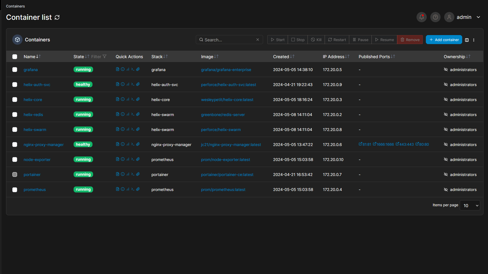
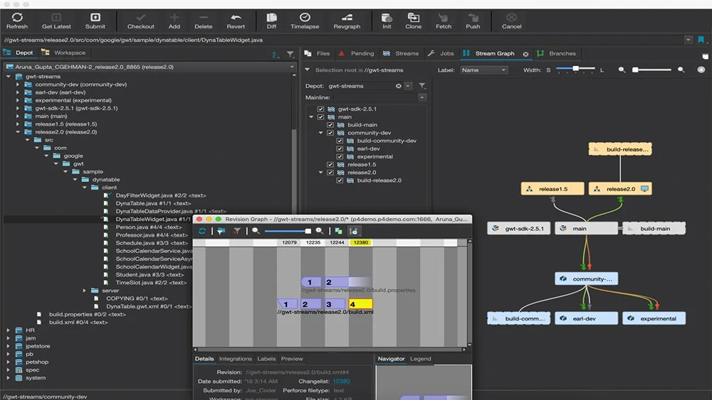
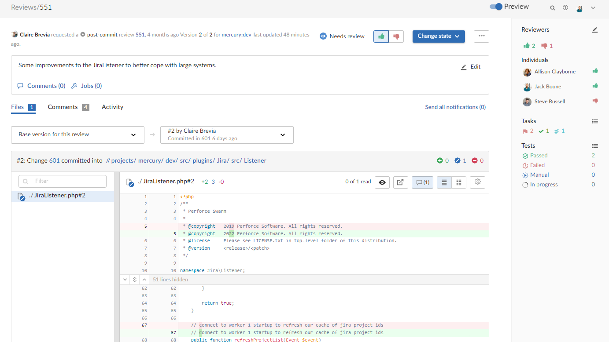
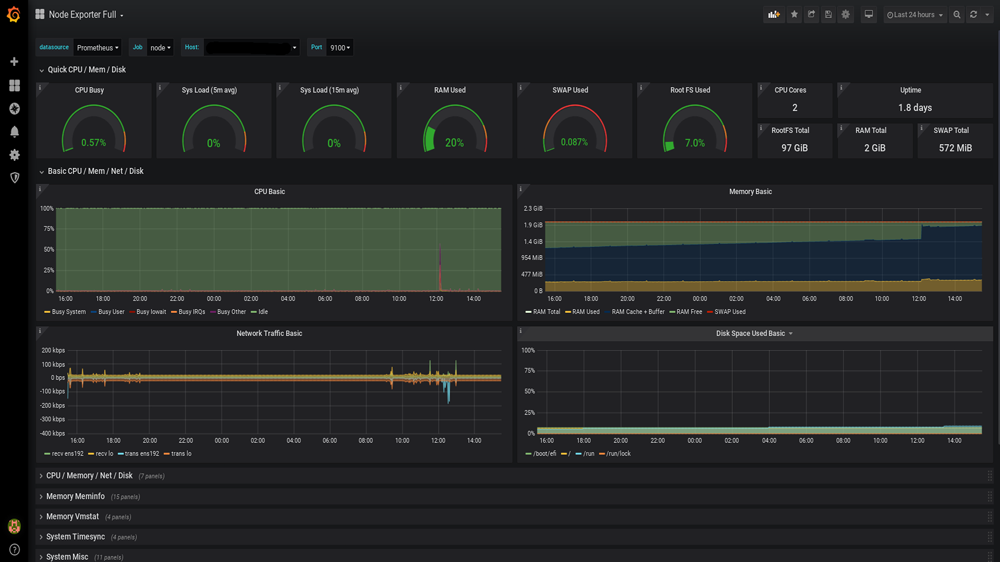
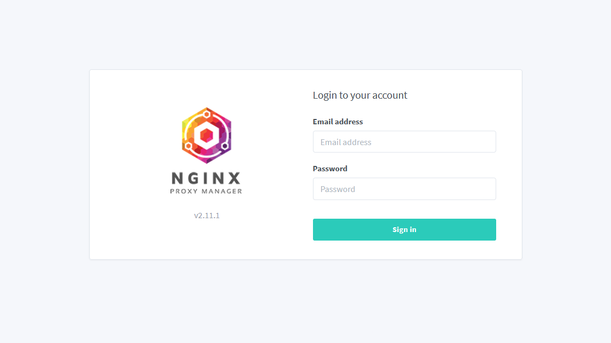

# Game production pipeline

Documentation hub to install and configure a game development pipeline (versioning, authentication, automatic build...) on self-host infrastructure.

## Why

This repository serves as a centralized hub for documentation, capturing the setup and configuration processes for our game development pipeline. It's designed to store comprehensive guides on versioning, authentication, automated builds, and other critical components, referencing official documentation to ensure accuracy and reliability. By documenting our configurations, we ensure consistency and facilitate easy replication for future setups or sharing with friends interested in similar projects.

## About The Project

We want our users to submit a change, create a review and have it trigger a build.  

For our pipeline, we will install several services :

- **Portainer** : User-friendly Docker container management tool with a web-based interface.
- **Nginx Proxy Manager** : User-friendly interface of a reverse proxy to expose your services easily and securely.
- **Helix Core** : Version control and collaboration platform widely used for managing source code and digital assets.
- **Helix Authentication Service** : Provides authentication and authorization services for securing access to Perforce applications.
- **Helix Swarm** : Code review and collaboration platform integrated with Helix Core.
- **Helix Digital Asset Management** : Solution for managing and versioning digital assets in a collaborative development environment.
- **Grafana** : Open-source platform for creating interactive and customizable dashboards to visualize time-series data.
- **Prometheus** : Open-source monitoring toolkit designed for collecting and processing time-series data.
- **Node Exporter** : Prometheus exporter that collects system-level metrics from Linux/Unix hosts, providing valuable insights into CPU, memory, disk, and network usage.
- **Jenkins** : Open-source automation server used for building, testing, and deploying software with support for continuous integration and delivery.

## Screenshots

  
  

  
  

  

## Installation

1. Follow [Docker and Portainer installation guide](docs/install-docker.md).
2. (Optional) If you want to enhances security and reliability of the web server (force https, authentication on admin website...), follow the [Nginx Proxy Manager installation guide](docs/install-nginx-proxy-manager-interface.md).
3. Follow [Helix Core installation guide](docs/install-helix-core.md).
4. Follow [Helix Authentication installation guide](docs/install-helix-authentication-service.md).
5. Follow [Helix Swarm installation guide](docs/install-helix-swarm.md).
6. Follow [Grafana and Prometheus installation guide](docs/install-grafana-with-prometheus.md).

## License

Distributed under the Apache-2.0 License. See `LICENSE` for more information.

## Contact

- Wesley Petit - [Website](https://wesleypetit.fr/) - wesley.petit.lemoine@gmail.com