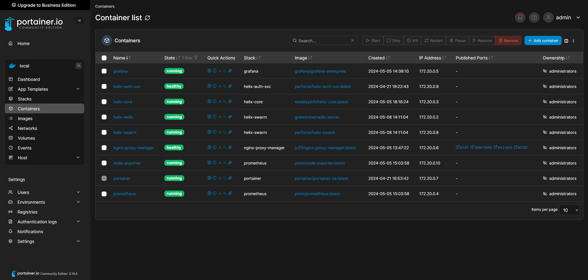

# Docker and Portainer installation guide

In this guide, we explain how to install Docker and Portainer.
<p align="center"></p>

## Installation

### [Docker](https://docs.docker.com/engine/install/debian/#install-using-the-repository)

1. Install necessary packages to use a repository over HTTPS :

   ```bash
   sudo apt install ca-certificates curl gnupg -y
   ```

2. Add Docker's official GPG key :

   ```bash
   sudo install -m 0755 -d /etc/apt/keyrings
   curl -fsSL https://download.docker.com/linux/debian/gpg | sudo gpg --dearmor -o /etc/apt/keyrings/docker.gpg
   sudo chmod a+r /etc/apt/keyrings/docker.gpg
   ```

3. Add the repository to apt sources :

   ```bash
   echo \
   "deb [arch=$(dpkg --print-architecture) signed-by=/etc/apt/keyrings/docker.asc] https://download.docker.com/linux/debian \
   $(. /etc/os-release && echo "$VERSION_CODENAME") stable" | \
   sudo tee /etc/apt/sources.list.d/docker.list > /dev/null
   ```

4. Update system :

   ```bash
   sudo apt update
   ```

5. Install Docker :

   ```bash
   sudo apt install docker-ce docker-ce-cli containerd.io docker-buildx-plugin docker-compose docker-compose-plugin -y
   ```

6. Verify that the installation is successful :

   ```bash
   sudo docker run hello-world
   ```

### Portainer

1. Copy the `docker-compose.yaml` file in your server :

   ```yaml
   version: '3'

   services:
      portainer:
         image: portainer/portainer-ce:latest
         container_name: portainer
         ports:
            - 9443:9443
         #networks:
         #   - nginx-proxy
         volumes:
            - ./data:/data
            # Bind the host’s Docker socket to manage the Docker installation it’s running within.
            - /var/run/docker.sock:/var/run/docker.sock
         restart: unless-stopped
         #networks:
         #   - nginx-proxy

   # networks:
   #   nginx-proxy:
   #     external: true
   ```

2. Install Portainer :

   ```bash
   sudo docker-compose up -d
   ```

3. Access Portainer Dashboard with the following address: [https://localhost:9443](https://localhost:9443). The first time you access Portainer, the system asks to create a password for the admin user. Type the password twice and select the Create user button.

## References

- [Docker installation](https://docs.docker.com/engine/install/debian/#install-using-the-repository)