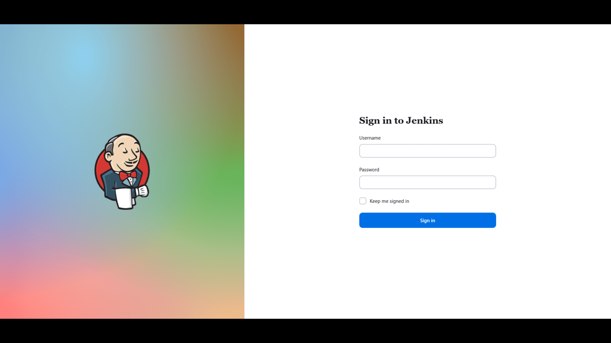
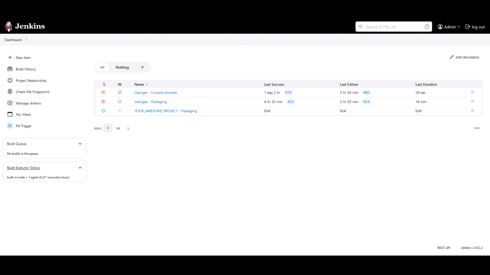
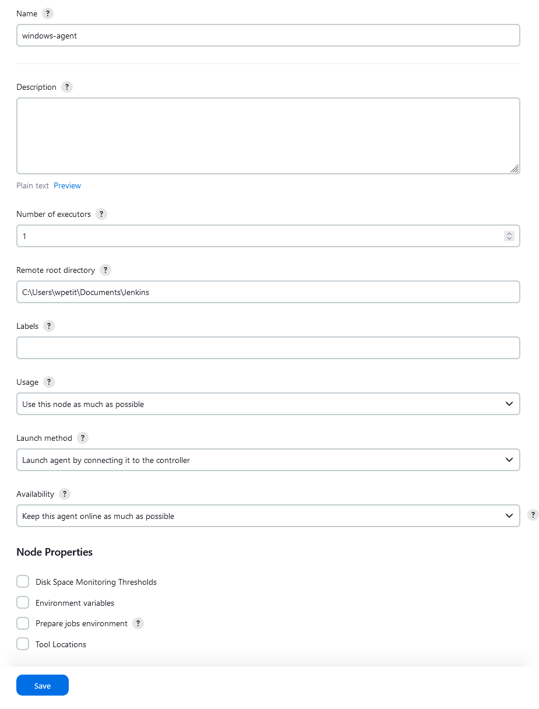
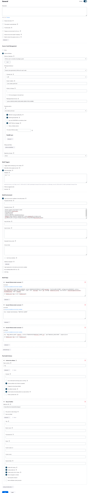
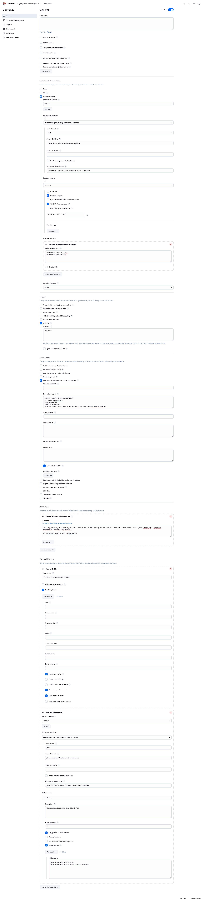
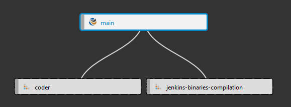
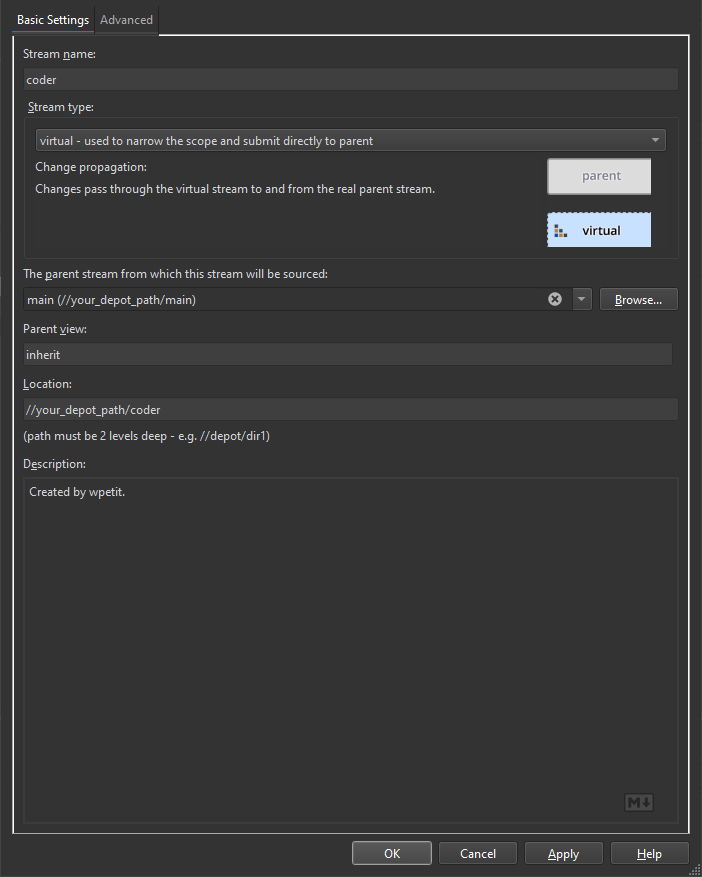
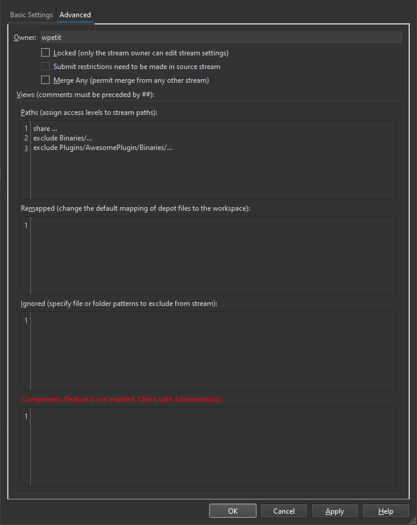
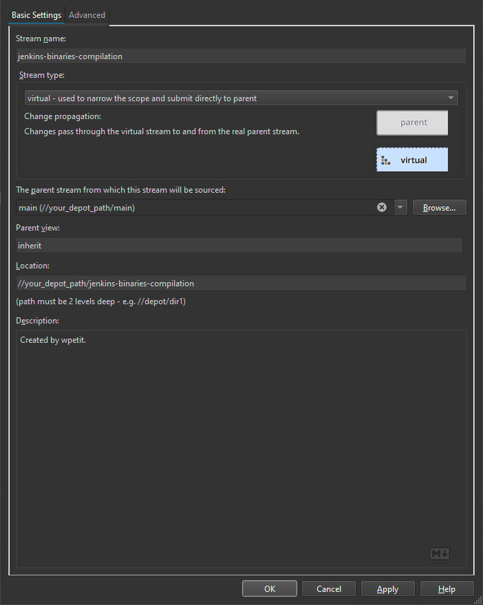
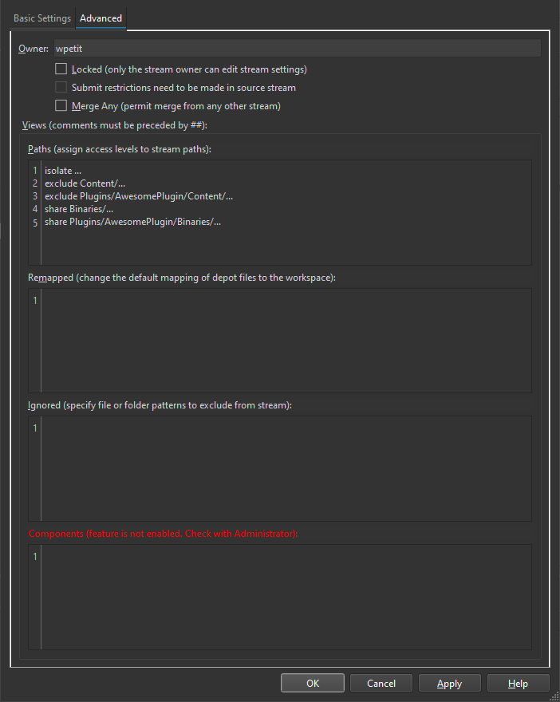

# Jenkins installation guide

In these guide, we explain how to setup Jenkins to automatically package and pre-compile an Unreal Engine project.

<p>
    
    
</p>

- [Jenkins installation guide](#jenkins-installation-guide)
  - [Installation](#installation)
    - [Install Jenkins Main docker](#install-jenkins-main-docker)
    - [Install a Windows Agent](#install-a-windows-agent)
  - [Configuration](#configuration)
    - [SSO with Auth0](#sso-with-auth0)
    - [Add Perforce Credentials](#add-perforce-credentials)
    - [Automatic builds for Unreal Engine](#automatic-builds-for-unreal-engine)
      - [Setup your pipeline](#setup-your-pipeline)
      - [Setup build steps](#setup-build-steps)
      - [Setup artifact](#setup-artifact)
      - [(Optional) Setup discord notification](#optional-setup-discord-notification)
  - [Precompile binaries for Unreal Engine](#precompile-binaries-for-unreal-engine)
    - [Setup Perforce Stream](#setup-perforce-stream)
    - [Setup your pipeline](#setup-your-pipeline-1)
      - [Setup pre-compile steps](#setup-pre-compile-steps)
      - [(Optional) Setup discord notification on failure](#optional-setup-discord-notification-on-failure)
      - [Submit in Perforce](#submit-in-perforce)
  - [References](#references)

## Installation

### Install [Jenkins Main docker](https://hub.docker.com/r/jenkins/jenkins)

1. Copy the `docker-compose.yaml` file in your server :

    ```yaml
    version: '3'

    services:
        jenkins-main:
            build:
                context: .
                dockerfile: Dockerfile
            container_name: jenkins-main
            restart: unless-stopped
            ports:
                - "8080:8080"
                - "50000:50000"
            volumes:
                - home:/var/jenkins_home
            # networks:
            #     - nginx-proxy

    # networks:
    #     nginx-proxy:
    #         external: true

    volumes:
        home:
    ```

2. Copy the `Dockerfile` next to your docker compose :

    ```Dockerfile
    FROM jenkins/jenkins:lts
    USER root
    RUN apt-get update && apt-get install -y lsb-release

    # Automatically install plugins
    USER jenkins
    RUN jenkins-plugin-cli --plugins "p4 matrix-auth postbuildscript preSCMbuildstep scmskip envinject discord-notifier saml"
    ```

    It will automatically install several plugins :  
       - [P4](https://plugins.jenkins.io/p4/) : Perforce Client plugin for the Jenkins SCM provider.  
       - [Matrix Authorization Strategy](https://plugins.jenkins.io/matrix-auth/) : Offers matrix-based security authorization strategies (global and per-project).  
       - [PostBuildScript](https://plugins.jenkins.io/postbuildscript/) : A plugin for the Jenkins CI to run several configurable actions after a build, depending on the build result.  
       - [Pre SCM BuildStep](https://plugins.jenkins.io/preSCMbuildstep/) :  This plugin allows build steps to be performed before the SCM step performs an action.  
       - [SCM Skip](https://plugins.jenkins.io/scmskip/) : Plugin adds functionality of preventing a Job to be built when a specific pattern ([ci skip]) in SCM commit message is detected.  
       - [Environment Injector](https://plugins.jenkins.io/envinject/) : This plugin makes it possible to set an environment for the builds.  
       - [Discord Notifier](https://plugins.jenkins.io/discord-notifier/) : Discord Notifier provides a bridge between Jenkins and Discord through the built-in webhook functionality.  
       - [SAML](https://plugins.jenkins.io/saml/) : A SAML 2.0 Plugin for the Jenkins Continuous Integration server.  

3. (Optional) If you want to use an anonymous account, pull `jenkins/jenkins:lts` from portainer or run :

    ```bash
    sudo docker pull jenkins/jenkins:lts
    ```

4. (Optional) If you install Nginx Proxy Manager, [add a new proxy host](install-nginx-proxy-manager.md#add-a-new-proxy-host) to forward the port 8080 and [add a new stream](install-nginx-proxy-manager.md#add-a-new-stream) to forward the port 50000.

5. Deploy your container :

    ```bash
    sudo docker-compose up -d
    ```

6. Finally, set up jenkins using [this documentation](https://phoenixnap.com/kb/install-jenkins-ubuntu#ftoc-heading-5).

7. Follow [this documentation](https://www.jenkins.io/doc/book/security/controller-isolation/#not-building-on-the-built-in-node) to disable building on the built-in node.

### Install a Windows Agent

1. Install Windows on your build server.

2. In the windows agent, install several programs :
    - [Visual Studio](https://visualstudio.microsoft.com/) with the [appropriate workloads](https://dev.epicgames.com/documentation/en-us/unreal-engine/setting-up-visual-studio-development-environment-for-cplusplus-projects-in-unreal-engine)
    - [.NET Framework 3.5](https://dotnet.microsoft.com/en-us/download/dotnet-framework/net35-sp1)
    - [Epic Games Launcher](https://store.epicgames.com/en-US/download)
    - The Unreal Engine version corresponding to your project.
    - [Java SDK 17](https://www.oracle.com/java/technologies/javase/jdk17-archive-downloads.html)
    - [Jenkins](https://www.jenkins.io/download/)

    :information_source: I write a [small script](assets/jenkins/Setup.ps1) to install Unreal Engine prerequisites (Visual Studio, .NET core, JDK11 and Jenkins). Only the Epic Games launcher is not automatically installed, as it does not provide an official package.

3. Now, go `Manage Jenkins > Nodes` in your Jenkins Main Dashboard.

4. Click on add `New Node`, enter a node name (e.g windows-unreal-engine) and pick `Permanent Agent`.

5. Specify the `Remote root directory` dedicated to Jenkins an click on Save.

    <p align="center"></p>

6. Now, click on the node and copy the given command in a file of your windows agent (e.g. LaunchAgent.bat).

7. To run your Jenkins agent automatically during system boot, open Task Scheduler.

8. Click on `Create Task...`.

9. Enter a meaningful name for the task (e.g., Jenkins Agent Startup).

10. Under the General tab, check `Run whether user is logged on or not`.

11. Under the Triggers tab, add a new trigger and set it to `At startup`, then click OK.

12. Under the Actions tab, create a bew action and set the Program/script field with the path to your .bat file that starts the Jenkins agent. Click OK.

13. Click OK to save the task.

14. Restart your server to test that the Jenkins agent runs automatically on boot.

## Configuration

### SSO with Auth0

We use Auth0, because it proposes a free tier without credit card that is limited to 7500 active user.

1. Create an account on [Auth0](https://auth0.com/signup?signUpData=%7B%22category%22%3A%22button%22%7D), it will unify authentication for Helix and other services. Complete all steps depending on your location.

2. In Auth0, create a `Regular Web Application` without specifying the technology. It will allow Jenkins to use Auth0 for Authentication.

3. Now, go to Applications > <YOUR_NEWLY_APPLICATION_CREATED> > Settings and keep aside your `Client ID` and `Domain`, as it will be needed for Jenkins settings.

4. In `Allowed Callback URLs`, add <YOUR_JENKINS_URI>/securityRealm/finishLogin

5. In `Allowed Logout URLs`, add <YOUR_JENKINS_URI>.

6. Scroll and open `Advanced Settings` section and click on `Endpoints`.

7. Copy the `SAML Metadata URL` field and open it in your browser. It's your IdP Metadata file needed for Jenkins settings.

8. Click on Save Changes.

9. Now, go back to your Jenkins dashboard.

10. Go in `Manage Jenkins > Security` and change `Security Realm` to SAML 2.0.

11. Copy and paste your IdP Metadata file in the appropriate field.

12. Set the `Username Attribute` to nameid and `Email Attribute` to email.

13. Add your IdP logout url (e.g https://<YOUR_AUTH0_DOMAIN>/v2/logout?client_id=<YOUR_AUTH0_CLIENT_ID>&returnTo=<YOUR_JENKINS_URI>).

14. Click apply and test on another browser. The idea is to modify settings without losing access.

### Add Perforce Credentials

1. Go to `Manage Jenkins > Credentials` and click on `(global)`.

2. Click on Add Credentials and select `Perforce Ticket Credential`.

3. Enter your P4PORT (without the ssl prefix).

4. If your helix core server use ssl connection, enable SSL connection checkbox and add your server fingerprint in the Trust field. Here is a command to get your server fingerprint :

    ```bat
    p4 -u <YOUR_USER_NAME> -p <YOUR_P4_PORT> trust -l
    ```

5. Enter your jenkins username and generate a [long-lived login ticket](https://www.perforce.com/manuals/p4sag/Content/P4SAG/superuser.basic.auth.tickets.html) :

    ```bat
    p4 -u <YOUR_USER_NAME> -p <YOUR_P4_PORT> login -ap
    ```

6. Click on Test Connection to debug your credentials then click on Save.

### Automatic builds for Unreal Engine

In these guide, we explain how to setup a Jenkins pipeline to automatically package an Unreal Engine project and (optionally) send a discord notification containing a download link to the package. These guide is heavily inspired by [Patrice Vignola guide](https://patricevignola.com/post/automation-jenkins-unreal), I updated the instructions with Unreal Engine 5.

<p align="center"></p>

#### Setup your pipeline

1. Go to `Dashboard > New Item` to create a new project.

2. Enter a name and pick Freestyle project.

3. Select Perforce Software in the Source Code Management section.

4. Pick a Perforce Credentials, change the `Workspace behavior` to Streams and define on which stream you want to package in `Stream Codeline`.

5. (optional) Setup build periodically for build triggers. In our case, we package the game every working day at 8AM (e.g H 8 * * 1-5).

6. Enable `Inject environment variables to the build process` and add these fields in the Properties Content field :

    ```conf
    PROJECT_NAME=<YOUR_PROJECT_NAME>
    BUILD_CONFIG=BuildCookRun
    PLATFORM=Win64
    CONFIG=Shipping
    ARCHIVE_DIRECTORY=%WORKSPACE%\Build
    ARTIFACT_NAME=%PROJECT_NAME%_Win_CL-%P4_CHANGELIST%_ID-%BUILD_ID%
    UE_REBUILD_BAT=C:\Program Files\Epic Games\UE_5.3\Engine\Build\BatchFiles\RunUAT.bat
    ```

    Here is a full explanation of each fields :  
        - **PROJECT_NAME** : It corresponds to your .uproject filename, we expect to find it under the workspace root folder.  
        - **BUILD_CONFIG** : Unreal automation commands (BuildCookRun, BuildGame...). You can find more using the command `<YOUR_ENGINE_FOLDER>\Build\BatchFiles\RunUAT.bat -List`.  
        - **PLATFORM** : Platforms to build, join multiple platforms using + (e.g Win64+PS4+XboxOne).  
        - **CONFIG** : Configurations to build, join multiple configurations using + (e.g Development+Test).  
        - **ARCHIVE_DIRECTORY** : Directory to archive the builds to.  
        - **ARTIFACT_NAME** : Final build name. In our case, we add the changelist and the jenkins build id in the name (e.g AwesomeProject_Win_CL-100_ID-0).  
        - **UE_REBUILD_BAT** : Path to RunUAT.bat file corresponding to your Unreal Engine version.  

#### Setup build steps

1. In the Builds Steps section, click on `Add Build Step` and pick `Execute Windows batch command`.

2. Add the following command to package your game :

    ```bat
    CALL "%UE_REBUILD_BAT%" %BUILD_CONFIG% -project="%WORKSPACE%\%PROJECT_NAME%.uproject" -Platform=%PLATFORM% -configuration=%CONFIG% -archive -archivedirectory="%ARCHIVE_DIRECTORY%" -clean -cook -skipstage -build -pak -package -makebinaryconfig -distribution -SkipCookingEditorContent -ForceMonolithic -NoP4 -NoSubmit
    
    IF %ERRORLEVEL% NEQ 0 (EXIT %ERRORLEVEL%)
    ```

    :information_source: For package arguments, the official [Unreal Automation Tool](https://dev.epicgames.com/documentation/en-us/unreal-engine/unreal-automation-tool-overview-for-unreal-engine?application_version=5.3) documentation is an good overview. If you need more information check out [Botman repository](https://github.com/botman99/ue4-unreal-automation-tool/tree/main).

3. Add a new Windows batch command to rename the package folder :

    ```bat
    CALL rename Build\Windows "%ARTIFACT_NAME%"
    ```

4. Add a new Windows batch command to zip the package folder :

    ```bat
    CALL "%UE_REBUILD_BAT%" ZipUtils -archive="%WORKSPACE%\%ARTIFACT_NAME%.zip" -add="%ARCHIVE_DIRECTORY%" -compression=9

    IF %ERRORLEVEL% NEQ 0 (EXIT %ERRORLEVEL%)
    ```

#### Setup artifact

1. In the Post-build actions section, click on `Add post-build action` and pick `Archive the artifacts`.

2. To add the generated build as an artifact, change the files to archive field to :

    ```conf
    *.zip
    ```

3. Click on Advanced and enable `Archive artifacts only if build is successful`.

#### (Optional) Setup discord notification

:warning: Only Jenkins authenticated user can download artifacts.

1. Follow the [Introduction to Webhooks](https://support.discord.com/hc/en-us/articles/228383668-Intro-to-Webhooks) guide to generate a Webhook URL.

2. Edit your jenkins pipeline.

3. In the Post-build actions section, click on `Add post-build action` and pick `Discord Notifier`.

4. Enter your Webhook URL.

5. Click on Advanced and enable `Enable URL linking` to redirect the discord message to the jenkins build.

6. Save, test and your are done !

## Precompile binaries for Unreal Engine

In these guide, we explain how to setup a Jenkins pipeline to automatically precompile and submit the DLLs in Perforce. Artists/designers will receive the DLLs and no longer need to compile. Optionally, we will send a discord notification on failed build. These guide is heavily inspired by the [Unreal Community Wiki](https://unrealcommunity.wiki/jenkins-example-windows-installation-perforce-z98w4map), I updated the instructions with Unreal Engine 5.

<p align="center"></p>

### Setup Perforce Stream

Here is the complete workflow :

- Coders make code changes and submit them to the coder stream.
- Jenkins monitors the mainline stream, syncs to the latest changes, builds the project, and submits the generated DLLs to the mainline stream.
- Artists/designers sync the mainline stream to receive the updated DLLs.

On the technical aspect, you need two virtual stream :  
    - **coder** : inherits from main but excludes all Binaries folders.  
    - **jenkins-binaries-compilation** :  inherits from main but excludes all Content folders since it won't need it.  

Here is the stream hierarchy :

<p align="center"></p>

1. Create a virtual stream for coders :

    <p align="center"></p>

2. In the `Advanced` tab, add the following paths and adapt it to your project :

    ```conf
    share ...
    exclude Binaries/...
    exclude Plugins/AwesomePlugin/Binaries/...
    ```

    <p align="center"></p>

3. Create a virtual stream for jenkins :

    <p align="center"></p>

4. In the `Advanced` tab, add the following paths and adapt it to your project :

    ```conf
    isolate ...
    exclude Content/...
    exclude Plugins/AwesomePlugin/Content/...
    share Binaries/...
    share Plugins/AwesomePlugin/Binaries/...
    ```

    <p align="center"></p>

### Setup your pipeline

1. In Jenkins home page, go to `Dashboard > New Item` to create a new project.

2. Enter a name and pick Freestyle project.

3. Select Perforce Software in the Source Code Management section.

4. Pick a Perforce Credentials, change the `Workspace behavior` to Streams and set the jenkins binaries stream in `Stream Codeline`.

5. Change `Populate Options` to Sync only, it's the best settings for incremental build.

6. Under polling build filters, click on `Add new build filter` and select `Exclude changes outside Java pattern`.

7. With the following pattern, a build we be triggered only when a changelist contains a code file (.h or .cpp) :

    ```conf
    //your_depot_path/main/.*\.cpp
    //your_depot_path/main/.*\.h
    ```

8. (optional) Enable Poll SCM for build triggers, Jenkins will scan the current workspace and compare with the server to trigger or not a build. In our case, we set the poll frequency to every 30 minutes (e.g H/30 * * * *).

9. Enable `Inject environment variables to the build process` and add these fields in the Properties Content field :

    ```conf
    PROJECT_NAME=<YOUR_PROJECT_NAME>
    BUILD_CONFIG=BuildEditor
    PLATFORM=Win64
    CONFIG=Development
    UE_REBUILD_BAT=C:\Program Files\Epic Games\UE_5.3\Engine\Build\BatchFiles\RunUAT.bat
    ```

    Here is a full explanation of each fields :  
        - **PROJECT_NAME** : It corresponds to your .uproject filename, we expect to find it under the workspace root folder.  
        - **BUILD_CONFIG** : Unreal automation commands (BuildCookRun, BuildGame...). You can find more using the command `<YOUR_ENGINE_FOLDER>\Build\BatchFiles\RunUAT.bat -List`.  
        - **PLATFORM** : Platforms to build, join multiple platforms using + (e.g Win64+PS4+XboxOne).  
        - **CONFIG** : Configurations to build, join multiple configurations using + (e.g Development+Test).  
        - **UE_REBUILD_BAT** : Path to RunUAT.bat file corresponding to your Unreal Engine version.  

#### Setup pre-compile steps

1. In the Builds Steps section, click on `Add Build Step` and pick `Execute Windows batch command`.

2. Add the following command to compile your game :

    ```bat
    CALL "%UE_REBUILD_BAT%" %BUILD_CONFIG% -platform=%PLATFORM% -configuration=%CONFIG% -project="%WORKSPACE%\%PROJECT_NAME%.uproject" -WaitMutex -FromMsBuild -notools -ForceCompile

    IF %ERRORLEVEL% NEQ 0 (EXIT %ERRORLEVEL%)
    ```

    :information_source: For package arguments, the official [Unreal Automation Tool](https://dev.epicgames.com/documentation/en-us/unreal-engine/unreal-automation-tool-overview-for-unreal-engine?application_version=5.3) documentation is an good overview. If you need more information check out [Botman repository](https://github.com/botman99/ue4-unreal-automation-tool/tree/main).

#### (Optional) Setup discord notification on failure

1. Follow the [Introduction to Webhooks](https://support.discord.com/hc/en-us/articles/228383668-Intro-to-Webhooks) guide to generate a Webhook URL.

2. Edit your jenkins pipeline.

3. In the Post-build actions section, click on `Add post-build action` and pick `Discord Notifier`.

4. Enter your Webhook URL.

5. Enable `Send only failed`.

6. Click on Advanced.

7. Enable `Enable URL linking` to redirect the discord message to the jenkins build and enable `Send log file to discord`.

8. Disable `Enable version info in footer` and `Enable artifact list`.

#### Submit in Perforce

1. In the Post-build actions section, click on `Add post-build action` and pick `Perforce: Publish assets`.

2. Pick a Perforce Credentials, change the `Workspace behavior` to Streams and set the jenkins binaries stream in `Stream Codeline`.

3. Change the `Publish Options` to Submit change.

4. Enable `Only publish on build success` and `Reopened files`. These options makes sure you submit only correct binaries and that Jenkins checkout for the next build.

5. Set a `Purge Revisions` (e.g 5) to only stores the last n revisions in Perforce.

6. Click on Advanced and add the following paths :

    ```conf
    //your_depot_path/main/Binaries/...
    //your_depot_path/main/AwesomePlugin/Binaries/...
    ```

    :warning: Submit with publish paths ignore p4ignore files.

7. Click on `Save`.

## References

- [Jenkins Docker Hub Page](https://hub.docker.com/r/jenkins/jenkins)
- [Jenkins Plugin P4](https://plugins.jenkins.io/p4/)
- [Jenkins Plugin Matrix Authorization Strategy](https://plugins.jenkins.io/matrix-auth/)
- [Jenkins Plugin PostBuildScript](https://plugins.jenkins.io/postbuildscript/)
- [Jenkins Plugin Pre SCM BuildStep](https://plugins.jenkins.io/preSCMbuildstep/)
- [Jenkins Plugin SCM Skip](https://plugins.jenkins.io/scmskip/)
- [Jenkins Plugin Environment Injector](https://plugins.jenkins.io/envinject/)
- [Jenkins Plugin Discord Notifier](https://plugins.jenkins.io/discord-notifier/)
- [Jenkins Plugin SAML](https://plugins.jenkins.io/saml/)
- [Jenkins Setup](https://phoenixnap.com/kb/install-jenkins-ubuntu#ftoc-heading-5)
- [Disable building on the built-in node](https://www.jenkins.io/doc/book/security/controller-isolation/#not-building-on-the-built-in-node)
- [Setting Up Visual Studio for Unreal Engine](https://dev.epicgames.com/documentation/en-us/unreal-engine/setting-up-visual-studio-development-environment-for-cplusplus-projects-in-unreal-engine)
- [Auth0](https://auth0.com/)
- [Ticket-based authentication](https://www.perforce.com/manuals/p4sag/Content/P4SAG/superuser.basic.auth.tickets.html)
- [Patrice Vignola packaging automation guide](https://patricevignola.com/post/automation-jenkins-unreal)
- [Unreal Automation Tool Overview](https://dev.epicgames.com/documentation/en-us/unreal-engine/unreal-automation-tool-overview-for-unreal-engine?application_version=5.3)
- [Unreal Automation Arguments](https://github.com/botman99/ue4-unreal-automation-tool/tree/main)
- [Introduction to Discord Webhook](https://support.discord.com/hc/en-us/articles/228383668-Intro-to-Webhooks)
- [Precompile an Unreal Project using Jenkins](https://unrealcommunity.wiki/jenkins-example-windows-installation-perforce-z98w4map)