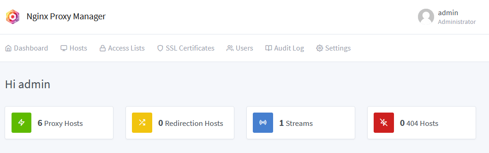
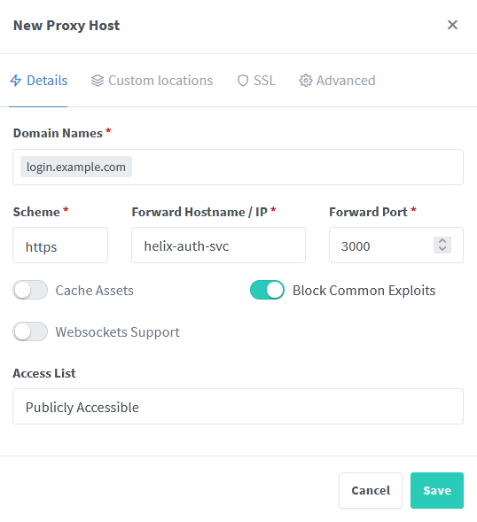
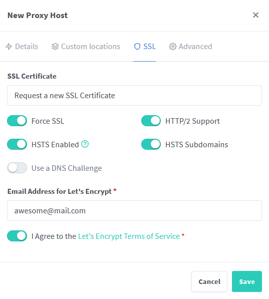
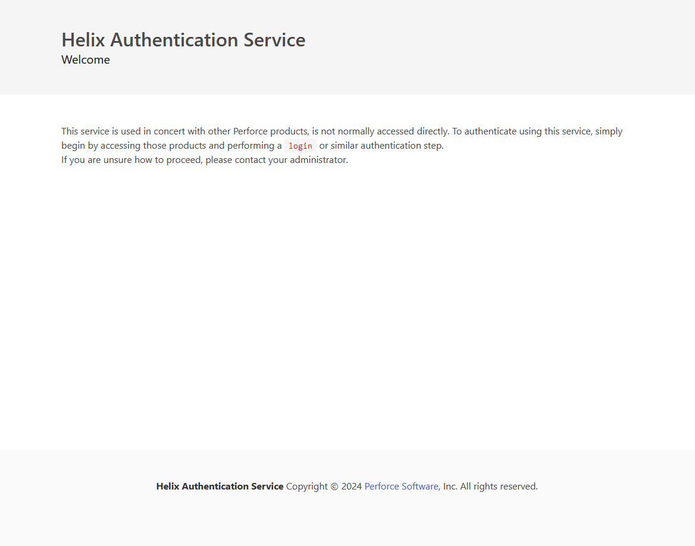

# Nginx proxy manager installation guide

In this guide, we explain how to install and configure a reverse proxy (force https, automatically renew your certificate...).

## Install

1. Copy this `docker-compose.yaml` file in your server :

    ```yaml
    version: "3.3"
    
    services:
        app:
            image: 'jc21/nginx-proxy-manager:latest'
            restart: unless-stopped
            container_name: nginx-proxy-manager
            ports:
                - '80:80'       # Public HTTP Port
                - '443:443'     # Public HTTPS Port
                - '81:81'       # Admin Web Port
            environment:
                # Uncomment this if you want to change the location of
                # the SQLite DB file within the container
                DB_SQLITE_FILE: "/data/database.sqlite"
            volumes:
                - ./data:/data
                - ./letsencrypt:/etc/letsencrypt
                # Bind logs to create fail2ban rules with access.log content
                - ./log:/var/log/nginx
            # Add docker health check
            # https://nginxproxymanager.com/advanced-config/#docker-healthcheck
            healthcheck:
                test: ["CMD", "/usr/bin/check-health"]
                interval: 10s
                timeout: 3s
            networks:
                - nginx-proxy
                - npm-internal

    # Create a custom network so you don't need to publish ports of other docker containers
    # https://nginxproxymanager.com/advanced-config/#best-practice-use-a-docker-network
    networks:
        npm-internal:
        nginx-proxy:
            external: true
    ```

2. For our configuration, we create a custom Docker network, so [you don't need to publish ports for your upstream services to all of the Docker host's interfaces.](https://nginxproxymanager.com/advanced-config/#best-practice-use-a-docker-network)

    ```bash
    sudo docker network create nginx-proxy
    ```

3. (Optional) If you want to use an anonymous account, pull `jc21/nginx-proxy-manager` from portainer or run :

   ```bash
   sudo docker pull jc21/nginx-proxy-manager:latest
   ```

4. In your firewall open 3 tcp ports (80, 443 and 81). The port 81 corresponds to nginx proxy manager web interface.

5. Deploy your container :

    ```bash
    sudo docker-compose up -d
    ```

6. Go to http://<YOUR_DOMAIN_NAME>:81 and connect with the default admin user :

    ```conf
    Email:    admin@example.com
    Password: changeme
    ```

    Once connected, a prompt will appear to change these settings.

## Configuration

## Add a new Proxy Host

We will use the Helix Authentication Service as an example.

1. In your hosting service, add a new DNS record pointing to your server. For the next steps, we will use login.example.com.

2. Comment the port section and uncomment the network section of the docker-compose.yaml

    ```yaml
    version: '3'

    services:
        helix-auth-svc:
            image: perforce/helix-auth-svc:latest
            container_name: helix-auth-svc
            restart: unless-stopped
            environment:
               - SVC_BASE_URI=<YOUR_SVC_BASE_URI> # e.g https://<YOUR_SRV_IP>:3000/ 
               - PROTOCOL=https
               - DEBUG=no
               - NODE_ENV=production
               - OIDC_ISSUER_URI=<YOUR_ISSUER>
               - OIDC_CLIENT_ID=<YOUR_CLIENT_ID>
               - OIDC_CLIENT_SECRET=<YOUR_CLIENT_SECRET>
            # ports:
            #    - "3000:3000"
            networks:
                - nginx-proxy

    networks:
        nginx-proxy:
            external: true
    ```

    :information_source: The idea is to to create a private network so you don't need to publish ports of other docker containers than Nginx.

3. If the container is already running, restart with the new configuration :

    ```bash
    sudo docker-compose up --build -d --remove-orphans
    ```

4. Go to your Nginx Proxy Manager dashboard (e.g http://<YOUR_DOMAIN_NAME>:81).

   <p align="center"></p>

5. Click on `Proxy Hosts` and `Add Proxy Host`.

6. Complete the form with your domain name. We use the hostname of our docker-compose to redirect proxy traffic to the service, not the hard-coded IP address of the container. For the forward port, it will be the same as the port commented out in the docker compose.

   <p align="center"></p>

7. Now click on SSL to request a new certificate for your subdomain, which will be automatically renewed. Just replace with your email address.

   <p align="center"></p>

8. Click on Save and you can now go to https://login.example.com/ to check that the redirection is working.

   <p align="center"></p>

## Add a new Stream

We will use Helix Core as an example.

1. Comment the port section and uncomment the network section of the docker-compose.yaml

    ```yaml
    version: '3'

    services:
        helix-core:
            image: wesleypetit/helix-core:latest
            container_name: helix-core
            restart: unless-stopped
            volumes:
                - ./data/p4dctl.conf.d:/etc/perforce/p4dctl.conf.d
                - ./data:/data
                - ./dbs:/dbs
            environment:
                - P4PORT=ssl:1666
                - P4ROOT=/data
            # ports:
            #     - 1666:1666
            networks:
                - nginx-proxy

    networks:
        nginx-proxy:
            external: true
    ```

    :information_source: The idea is to to create a private network so you don't need to publish ports of other docker containers than Nginx.

2. If the container is already running, restart with the new configuration :

    ```bash
    sudo docker-compose up --build -d --remove-orphans
    ```

3. Add the port 1666 in the Nginx Proxy Manager docker-compose.

    ```yaml
    ports:
        - '80:80'       # Public HTTP Port
        - '443:443'     # Public HTTPS Port
        - '81:81'       # Admin Web Port
        - '1666:1666'   # Helix Core
    ```

4. Deploy Nginx Proxy Manager :

    ```bash
    sudo docker-compose up --build -d
    ```

5. Go to your Nginx Proxy Manager dashboard (e.g http://<YOUR_DOMAIN_NAME>:81).

   <p align="center"></p>

6. Click on `Streams` and `Add Stream`.

7. Complete the form, we use the hostname of our docker-compose to redirect proxy traffic to the service, not the hard-coded IP address of the container. For the forward port, it will be the same as the port commented out in the docker compose.

   <p align="center"></p>

8. With P4V checked that you still have access to Helix Core.

## References

- [Official installation guide](https://nginxproxymanager.com/setup/)
- [Complete installation guide](https://www.howtoforge.com/how-to-install-and-use-portainer-for-docker-management-with-nginx-proxy-manager/)
- [Docker secrets configuration](https://nginxproxymanager.com/advanced-config/#docker-file-secrets)
- [Create a docker network](https://nginxproxymanager.com/advanced-config/#best-practice-use-a-docker-network)
- [Default admin user](https://nginxproxymanager.com/guide/#quick-setup)
