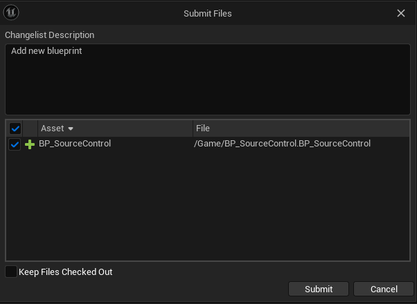

# Perforce User guide for Unreal Engine


## Installation

### P4V

1. Download and install [P4V](https://www.perforce.com/downloads/helix-visual-client-p4v).

2. In P4V, enter the address given by your Helix Core Server administrator in the Server label.

3. Enter your username which is the first letter of your first name, and your full last name (for example, if your name is John Doe, il will be jdoe).

   

4. Click on OK, then this prompt will appear :

   

   Choose `Unicode (UTF-8)` then valid.

6. A Window or a web page will be displayed, enter your credentials (email and password).

7. Now, you can see P4V interface.

   

It has 3 main pane :

* **Toolbar** : Provides quick access to a subset of actions and tools available from the menu bar. To get information about a toolbar item or other object in P4V, move the mouse pointer over the object. P4V displays a small window (tooltip) containing status or explanatory information about the object. P4V makes extensive use of tooltips.

* **Left pane** : Includes the following tabs:
  * **Depot Tree** : Shows all of the files in the depot.
  * **Workspace Tree** : Shows the files on your computer, including files that are not in the depot

* **Right pane** : Contains tabs for working with changelists, labels, workspaces, users, jobs, streams, and branches.

### Get the project

1. In P4V, create a new workspace with Connection > New Workspace.
2. Change the workspace to follow a convention : username_stream-name (e.g jdoe_main or jdoe_arts).
3. Choose the folder on which the files will be put in workspace root.
4. For the stream, select Browse and pick //<YOUR_PROJECT_NAME>/main.

   

5. Go to Advanced, enable `Rmdir` and select `Revert unchanged files` in `On submit` dropdown.

   

6. Press OK.
7. On the left pane, click on `Workspace` tab and select the folder. Then, click of the big `Get Latest` button on the top toolbar.

   You now have the last version of the project.

8. Open a terminal and type :

   ```bash
   p4 set P4IGNORE=.p4ignore.txt
   ```

## Configuration

### Configuration with Unreal Engine

1. Go to your working directory and open the .uproject.

2. At the bottom right corner, click on Revision Control > Connect to Revision Control.

3. In provider, select Perforce.

4. Most of the info should autocomplete (if not, enter same info as for P4V).

5. You should see your newly created workforce in the `Available workspaces` dropdown. Select it.

6. Click `Accept Settings`. Now perforce integration is activated.

7. In File > Editor Preferences, search and enable `Automatically Checkout on Asset Modification`.

## Usage

:warning: Always open P4V before opening your project, because it will refresh all files states (locked, outdated...).

## Get Latest Version

1. In Unreal Engine, right click on the `Content` folder

# TODO show sync on a folder

### Submit a changelist

1. Create a new Blueprint and save it. A green sum sign appear on the new Blueprint meaning it's mark for add.

   

2. At the bottom right corner, click on Revision Control > Submit Content. This window will be displayed :

   

3. After setting a description, you just need to click on `Submit`.

## Glossary

| Notion            | Git notion | Definition                                                                                                                    |
| ----------------- | ---------- | ----------------------------------------------------------------------------------------------------------------------------- |
| Depot             | Repository | A file repository hosted by server.                                                                                           |
| Workspace         | NA         | Folders or directories on your workstation where you work on revisions of files that are managed by the Helix Core server.    |
| Check out         | git add    | To designate one or more files, or a stream, for edit.                                                                        |
| Stream            | git branch | A "branch" with built-in rules that determines what changes should be propagated and in what order they should be propagated. |
| Get Latest / Sync | git pull   | To copy a file revision (or set of file revisions) from the Helix server depot to a client workspace.                         |
| Submit            | git push   | To send a pending changelist into the Helix server depot for processing.                                                      |
| Changelist        | commit     | A list of files, their version numbers, the changes made to the files, and a description of the changes made.                 |
| Revision          | NA         | File version.                                                                                                                 |
| Revert            | git revert | To discard the changes you have made to a file in the client workspace before a submit.                                       |
| Shelve            | git stash  | The process of temporarily storing files in the Helix server without checking in a changelist.                                |

## References

* [P4V User guide](https://www.perforce.com/manuals/p4v/p4v.pdf)
