# Perforce User guide for Unreal Engine

- [Perforce User guide for Unreal Engine](#perforce-user-guide-for-unreal-engine)
  - [Concepts](#concepts)
  - [Installation](#installation)
    - [P4V Client](#p4v-client)
    - [Get the project](#get-the-project)
  - [Configuration](#configuration)
    - [Configuration with Unreal Engine](#configuration-with-unreal-engine)
  - [Usage](#usage)
    - [P4V](#p4v)
      - [Create a changelist](#create-a-changelist)
      - [Create a review](#create-a-review)
      - [Submit a changelist](#submit-a-changelist)
      - [Shelve](#shelve)
      - [Unshelve](#unshelve)
      - [Create a stream](#create-a-stream)
      - [Retrieve a stream](#retrieve-a-stream)
      - [Resolve conflict](#resolve-conflict)
    - [Unreal Engine](#unreal-engine)
      - [Create a changelist](#create-a-changelist-1)
      - [Submit a changelist](#submit-a-changelist-1)
      - [Review a changelist](#review-a-changelist)
  - [Glossary](#glossary)
  - [References](#references)

In these guide we will install P4V and configure Unreal Engine to use your Helix Core server.

  
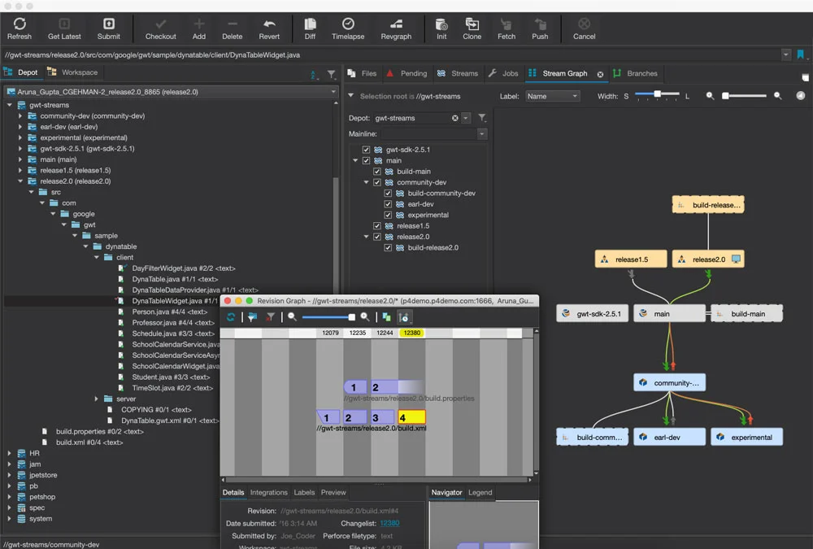

## Concepts

  
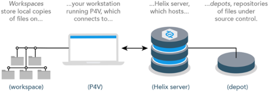

## Installation

### P4V Client

1. Download and install [P4V](https://www.perforce.com/downloads/helix-visual-client-p4v).

2. In P4V, enter the address and the username given by your Helix Core Server administrator.

    
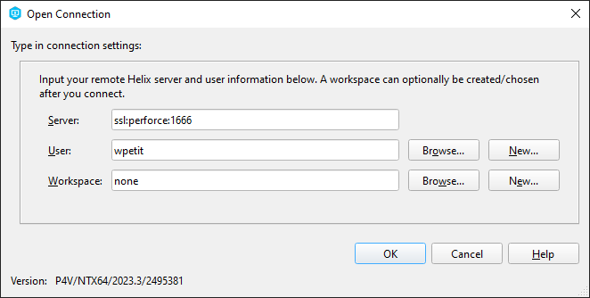

3. Click on OK, then this prompt will appear :

    
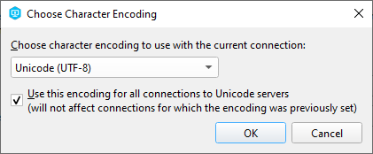

   Choose `Unicode (UTF-8)` then valid.

4. If a window appear, enter your password. Else, click on `Sign Up` and enter your credentials.

5. Now, you can see P4V interface.

    
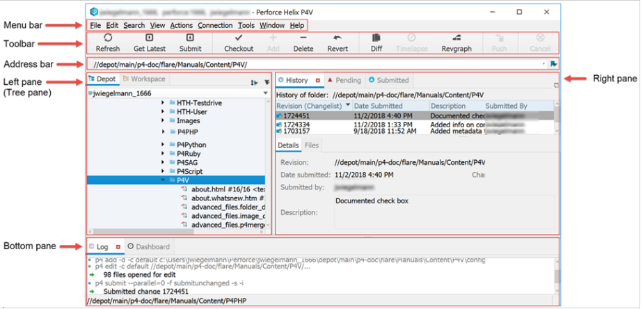

It has 3 main pane :

- **Toolbar** : Provides quick access to a subset of actions and tools available from the menu bar. To get information about a toolbar item or other object in P4V, move the mouse pointer over the object. P4V displays a small window (tooltip) containing status or explanatory information about the object. P4V makes extensive use of tooltips.

- **Left pane** : Includes the following tabs:
  - **Depot Tree** : Shows all of the files in the depot.
  - **Workspace Tree** : Shows the files on your computer, including files that are not in the depot

- **Right pane** : Contains tabs for working with changelists, labels, workspaces, users, jobs, streams, and branches.

### Get the project

1. Follow the step to switch [stream](#retrieve-a-stream) and pick the main stream.

2. You have now the last version of the project.

## Configuration

### Configuration with Unreal Engine

1. Go to your working directory and open the .uproject.

2. At the bottom right corner, click on `Revision Control > Connect to Revision Control`.

3. In provider, select Perforce.

4. Most of the info should autocomplete (if not, enter same info as for P4V).

5. You should see your newly created workforce in the `Available workspaces` dropdown. Select it.

6. Click `Accept Settings`. Now perforce integration is activated.

7. In Edit > Editor Preferences, search and enable `Automatically Checkout on Asset Modification`.

## Usage

### P4V

#### Create a changelist

1. Go to the Pending Changelists pane (View > Pending changelists).

    
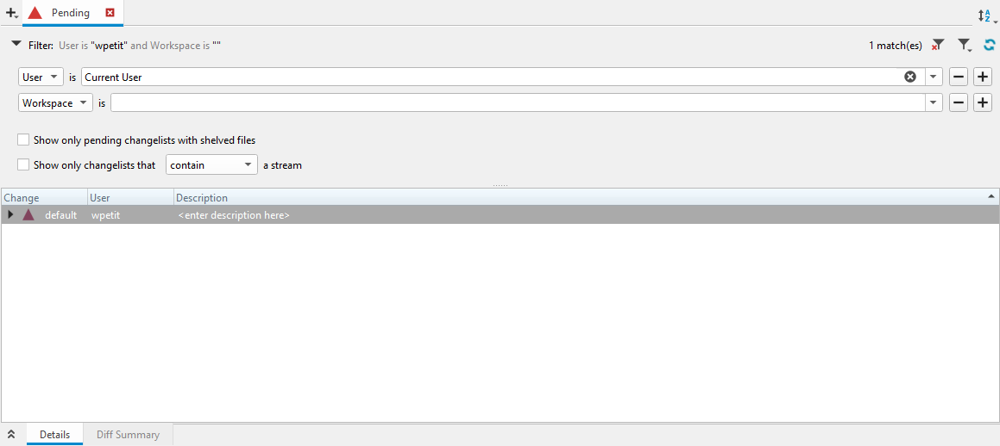

2. You should see the default changelist listed at the top. This changelist contains files that have been modified but not yet submitted. Double-click on the default changelist, add a description and uncheck any files you don't want to appear in the new changelist.

    

3. Click on save to create a new changelist and it will appear in the Pending Changelists pane.

---

#### Create a review

1. Go to the Pending Changelists pane (View > Pending changelists).

2. Edit the changelist you want to create a review and add the `#review` keyword in the description.

3. Go to your swarm site and you'll find your review.

---

#### Submit a changelist

1. Go to the Pending Changelists pane (View > Pending changelists).

2. Right-click on the changelist you want to submit then select `Submit...`.

3. Add a description, check all files again and click on Submit.

---

#### Shelve

*Shelve is the process of temporarily storing files in the Helix server without checking in a changelist.*

1. Go to the Pending Changelists pane (View > Pending changelists).

2. Right-click on the changelist you want to shelve and select `Shelve Files...`.

3. Uncheck the files you don't want to shelve and click on Shelve. Now everyone can get your changes without having to submit them.

---

#### Unshelve

*Unshelve is the process to pick a shelve changelist and apply its modification in your workspace.* So that you can pick someone else's changelist to review or debug.

1. Go to the Pending Changelists pane (View > Pending changelists).

2. (Optional) If the shelve belongs to someone else, replace the user in the Pending changelists search bar (e.g hpasquier).

    
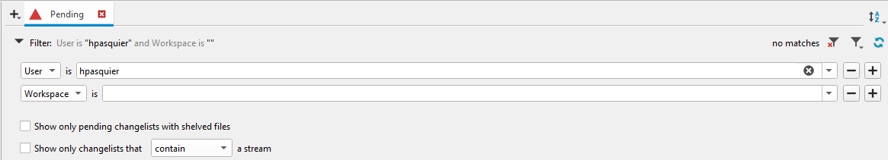

3. Right-click on the changelist and select `Unshelve Files...`.

#### Create a stream

1. Go to the Stream Graph pane (View > Stream Graph).

    
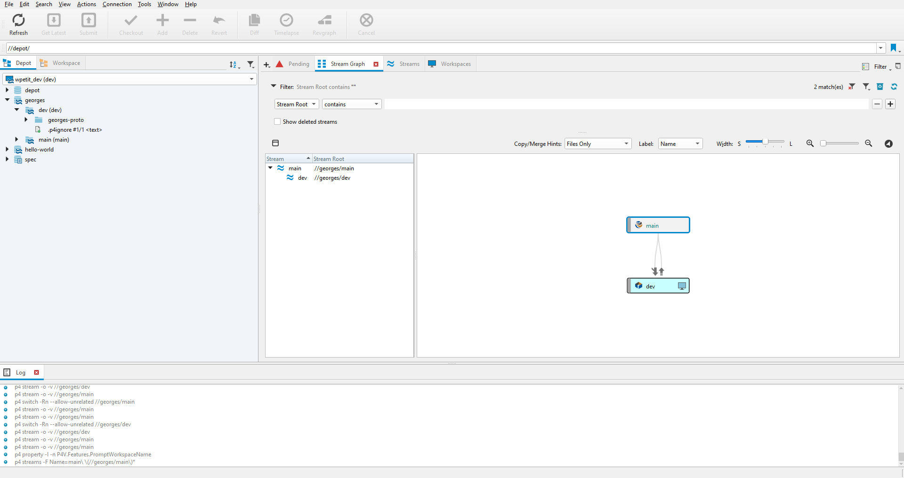

2. Press Ctrl+N and add a stream name.

    
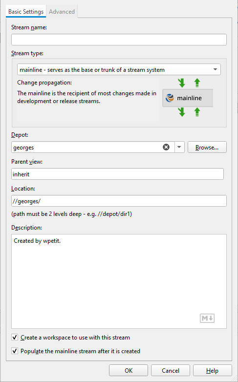

3. Select the stream type corresponding to your need :

    
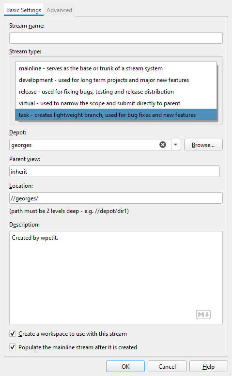

    :warning: Keep in mind that Helix Core copy the entire project for each stream (except virtual stream).

4. Click on OK.

---

#### Retrieve a stream

1. Create a new workspace with Connection > New Workspace.
2. Change the workspace to follow a convention : username_stream-name (e.g jdoe_main or jdoe_arts).
3. Choose the folder on which the files will be put in workspace root.
4. For the stream, select Browse and pick the stream you want (e.g //<YOUR_PROJECT_NAME>/main).

    
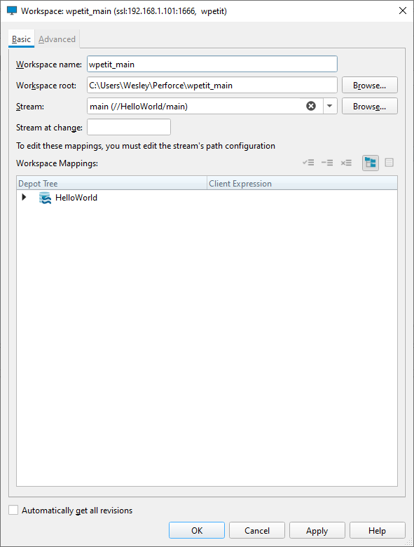

5. Go to Advanced, enable `Rmdir` and select `Revert unchanged files` in `On submit` dropdown.

    
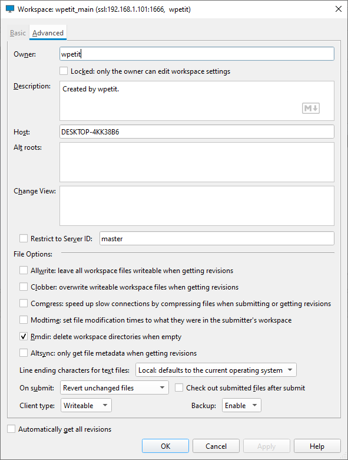

6. Press OK.
7. On the left pane, click on `Workspace` tab and select the folder. Then, click of the big `Get Latest` button on the top toolbar.

---

#### Resolve conflict

1. Conflict files have a question mark icon.

    
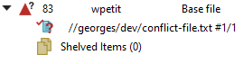

2. Right-click on the file and pick `Resolve...`.

3. The resolve window will open and provide you with multiple options (Accept Source, Accept Target...).

    
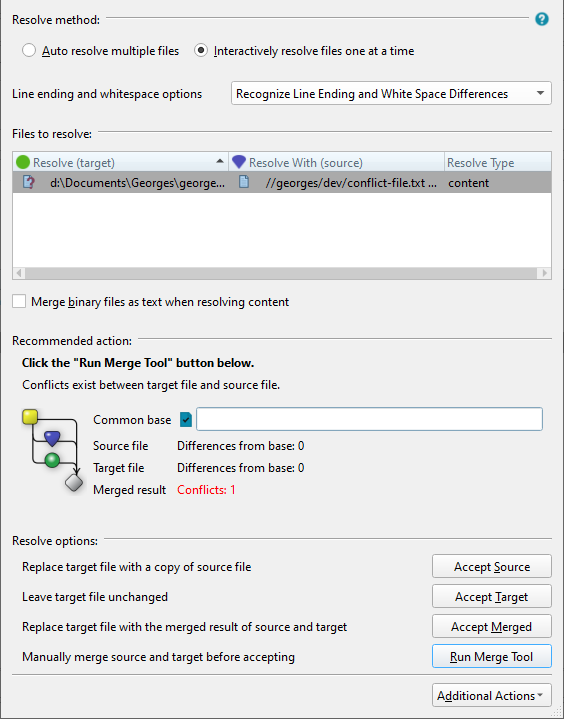

4. We recommend to `Run Merge Tool` and it will show conflict sections.

    
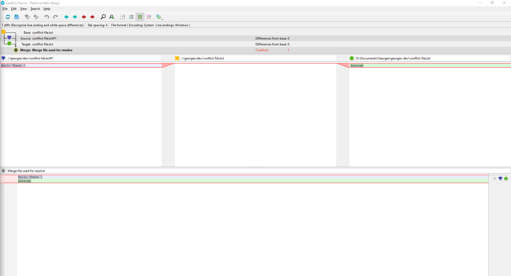

    From left to right, you have the source, base and target.
        - Source : Your changes.
        - Base : Version you based your changes.
        - Target : Current version in Helix Core.

5. For each conflict, you can pick the version using the bottom window. Each conflict has 2 icons next to it (blue for source and green for target), you just have to click on the corresponding icon.

    
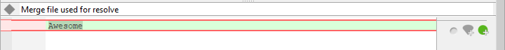

6. Save your changes (Ctrl + S) and close the window. P4V will automatically propose to replace the conflict file with the merged result file, click on yes.
7. Repeat the process for each file and your are done !

### Unreal Engine

:warning: Always open P4V before opening your project, because it will refresh all files states (locked, outdated...).

#### Create a changelist

1. Create a new Blueprint and save it. A green sum sign appear on the new Blueprint meaning it's mark for add.

    
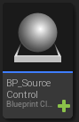

2. At the bottom right corner, click on Revision Control > View Changes. It list all pending changelist.

    
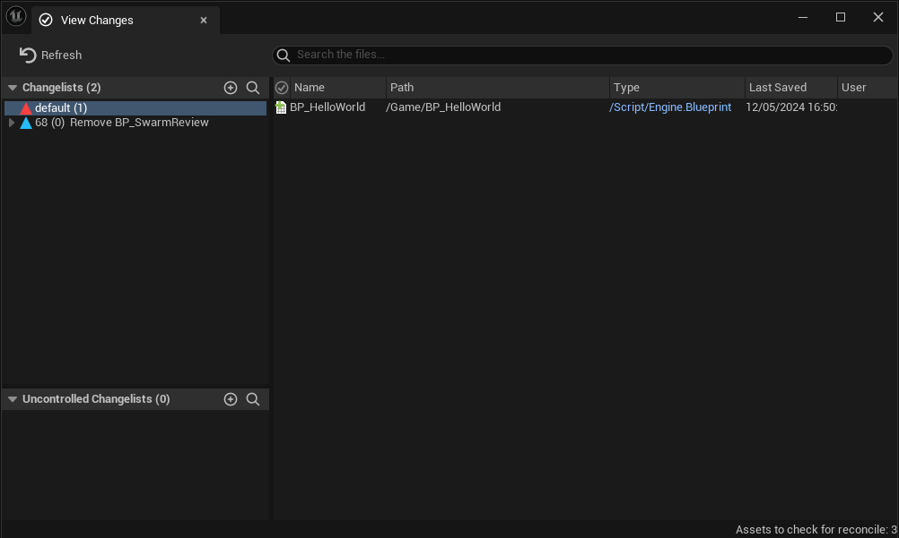

   :information_source: Your new blueprint will be linked to the `default` changelist.

3. Right-click on your file in the default changelist and select `Move Files To...`.

    
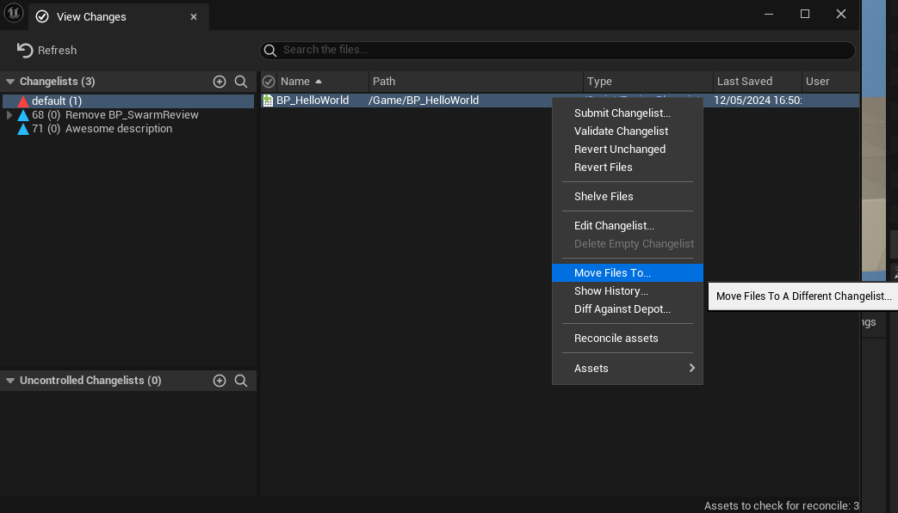

4. Add a description and click OK. You have created a new changelist !

   You can also create a new changelist by clicking on the + button :

    

---

#### Submit a changelist

1. Create a new Blueprint and save it.

2. At the bottom right corner, click on Revision Control > Submit Content. This window will be displayed :

    

3. By default, your changelist will contains every files updated. Don't forget to remove files you don't want to submit yet.

4. After setting a description, you just need to click on `Submit`.

---

#### Review a changelist

You can pick someone else's changelist to review or debug.

1. At the bottom right corner, click on Revision Control > Review Changelists. This window will be displayed :

    
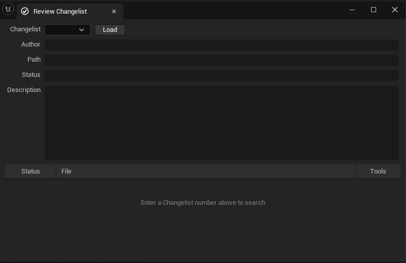

2. Pick the changelist you want to load and now you are good to go !

## Glossary

| Notion            | Git notion | Definition                                                                                                                    |
| ----------------- | ---------- | ----------------------------------------------------------------------------------------------------------------------------- |
| Depot             | Repository | A file repository hosted by server.                                                                                           |
| Workspace         | NA         | Folders or directories on your workstation where you work on revisions of files that are managed by the Helix Core server.    |
| Check out         | git add    | To designate one or more files, or a stream, for edit.                                                                        |
| Stream            | git branch | A "branch" with built-in rules that determines what changes should be propagated and in what order they should be propagated. |
| Get Latest / Sync | git pull   | To copy a file revision (or set of file revisions) from the Helix server depot to a client workspace.                         |
| Submit            | git push   | To send a pending change list into the Helix server depot for processing.                                                     |
| Change list       | commit     | A list of files, their version numbers, the changes made to the files, and a description of the changes made.                 |
| Revision          | NA         | File version.                                                                                                                 |
| Revert            | git revert | To discard the changes you have made to a file in the client workspace before a submit.                                       |
| Shelve            | git stash  | The process of temporarily storing files in the Helix server without checking in a changelist.                                |

## References

    - [P4V User guide](https://www.perforce.com/manuals/p4v/p4v.pdf)
